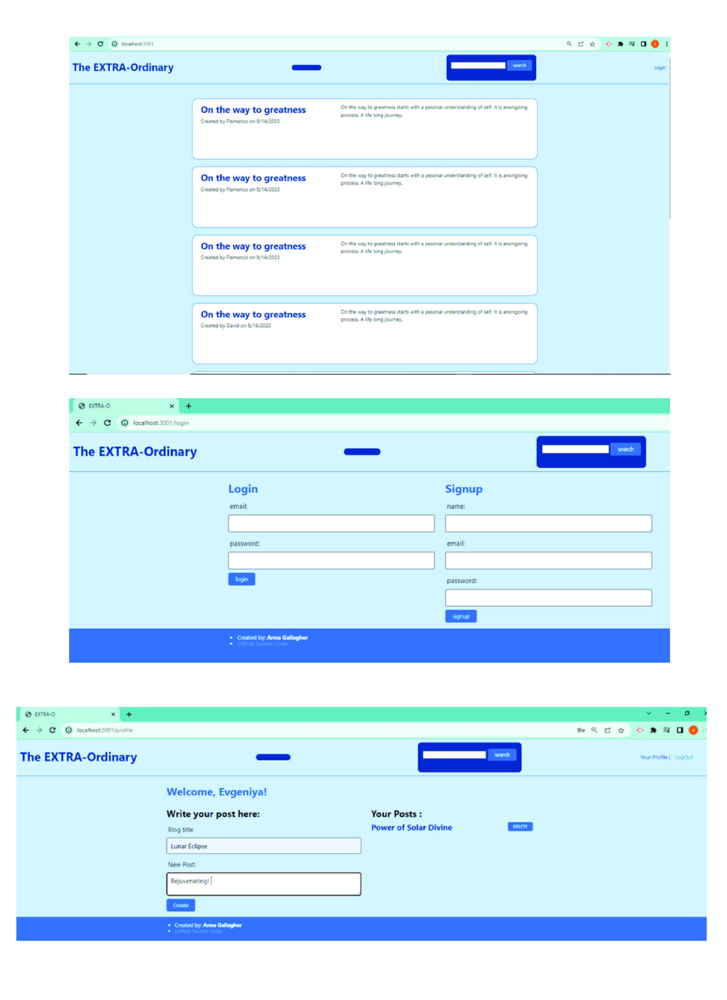

# The-EXTRA-Ordinary

https://github.com/anna071387/The-EXTRA-Ordinary

## Description
The app EXTRA-Ordinary is a blog type entry website where people can register and participate in creation of a blog content.

It is Easy to create an account by entering a personal username, provide an email and a password.  

## Use
*   For a new user: select Register button that will take you to the registration form. Create an account.
*   For an existing user: select Login button. Provide username, email, and password. If the account already exists you will be redirected to the personal account page. 
*	When logged in you are prompted to create a new blog post and you may the list of previous blog posts.  
*	The landing page shows the library of all posts older to newer order.  
*	Every loggedin user will have an option to logout. 
 

## Result
It is easy to create a text blog post that includes a title, date and who created it. 

### Technologies Used:

* **Handlebars**: Used for conditional rendering
* **Squelize**: Used to add all functionality
* **Node.js**: Used with NPM to manage support packages
* **Express.js**: (npm package) Used to manage routing and API setup
* **express-handlebars**: (npm package) Handlebars view engine for Express
* **mysql, mysql2**: (npm package) MySQL driver
* **MySQL**: Database

This project is designed with help of following sources: 
© 2023 edX Boot Camps LLC, teaching materials and videos.
Helping of Teaching assitants, teacher and tutoring assistants at the bootcamp. 
Further resources include: W3schools, and personally conducted research.

